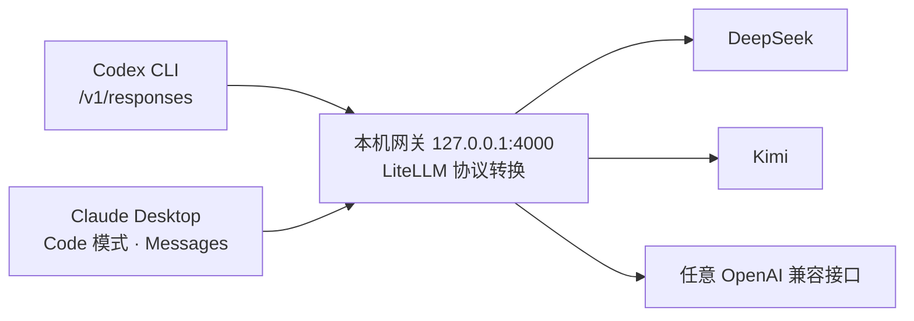

<div align="center">


# Codex Chat Gateway

**把只支持 Chat Completions 的第三方模型，接入 Codex 和 Claude Desktop 的 Code 模式**

[](https://github.com/xuyuanzhang1122/codex-chat-gateway-windows/actions/workflows/release.yml)
[](https://github.com/xuyuanzhang1122/codex-chat-gateway-windows/releases)
[](https://github.com/xuyuanzhang1122/codex-chat-gateway-windows/releases/latest)
[](LICENSE)

[](https://github.com/xuyuanzhang1122/codex-chat-gateway-windows/releases/latest)

[快速开始](#-快速开始) · [功能特性](#-功能特性) · [脚本速查](#-脚本速查) · [更新记录](CHANGELOG.md)

</div>

> [!NOTE]
> 本项目是社区兼容工具，不是 OpenAI 官方项目。

<div align="center">

</div>

## 🧩 它是做什么的

Codex 请求本机的 `/v1/responses`，Claude Desktop 的 Code 模式请求 Anthropic Messages 接口——而 DeepSeek、Kimi 等第三方模型通常只支持 Chat Completions。本项目在本机 `127.0.0.1:4000` 运行一个 LiteLLM 网关，把两种客户端协议实时转换成上游模型商支持的格式。配置模型、启动网关、接入客户端，全部在桌面控制台里点几下完成。



<details>
<summary><b>为什么不自己实现转换器？</b></summary>

Responses API 不只是字段改名，还涉及 SSE 流式事件、工具调用、错误映射、参数兼容和多轮上下文。本项目直接复用 LiteLLM，只负责 Windows 一键安装、密钥隔离、Codex TOML 安全写入和健康检查。

</details>

## ✨ 功能特性

| 特性 | 说明 |
|---|---|
| 🖥️ **桌面控制台** | 原生 WPF 深色界面：网关启动 / 停止 / 重启，实时显示 PID、运行时长与当前模型；最小化到系统托盘，单实例运行 |
| 📦 **一键安装包** | 品牌化深色 Inno Setup 安装程序：中文 / 英文界面、用户级免管理员安装、升级保留模型配置 |
| 🧳 **便携版** | 内置 Python 运行时与全部已验证依赖，空白 Windows x64 解压即用，无需 Python / Docker / Git |
| 🧠 **多模型管理** | 增删改、在线获取模型列表、默认模型一键切换；桌面端与脚本双入口 |
| 🔀 **双客户端接入** | 同一个默认模型同时服务 Codex 与 Claude Desktop 的 Sonnet / Opus / Haiku 路由 |
| ↩️ **安全恢复** | 一键恢复 Codex / Claude Desktop 官方配置，完整保留 MCP、插件与其他 Profile |

## 🚀 快速开始

### 1️⃣ 下载

前往 [GitHub Releases](https://github.com/xuyuanzhang1122/codex-chat-gateway-windows/releases/latest) 下载最新版：

| 文件 | 说明 |
|---|---|
| **`CodexChatGateway-Setup-vX.Y.Z.exe`** | 推荐。图形安装程序，含开始菜单入口、可选桌面快捷方式和登录自启 |
| `codex-chat-gateway-portable-vX.Y.Z-windows-x64.7z` | 免安装便携版，需解压完整目录（不能只复制几个 `.bat`） |
| 同名 `.sha256` | 校验下载文件完整性 |

### 2️⃣ 添加模型并启动网关

双击桌面的 **Codex Chat Gateway**（或便携目录中的 `桌面版.bat`）打开控制台：

1. 点击 **添加模型**，按 API URL、Key、模型的顺序配置——模型 ID 可手动填写，也可在线获取列表后选择；
2. 点击 **启动网关**，网关进入隐藏后台运行，关闭窗口不会停止服务。

也可以完全使用脚本：`模型配置.bat` → `启动网关.bat` → `检查网关.bat`。

### 3️⃣ 接入客户端

| 客户端 | 操作 |
|---|---|
| **Codex** | 双击 `配置Codex.bat`（写入前自动备份并保留现有 MCP），然后完全退出并重启 Codex |
| **Claude Desktop** | 双击 `配置Claude Desktop Code模式.bat`，完全退出（含托盘进程）后重新打开并进入 Code 模式 |

> [!TIP]
> 接入后，Codex 中使用的模型名是 **`codex-chat`**，本地地址是 **`http://127.0.0.1:4000/v1`**。

想退出第三方网关？双击 `恢复Codex官方配置.bat` / `恢复Claude Desktop官方配置.bat`，只撤销网关相关设置，不影响 MCP、插件、功能开关和其他 Profile。

## 🖥️ Claude Desktop 的 Code 模式

这里配置的是 Claude Desktop **应用内的 Code 模式**，不是普通聊天、MCP 配置，也不是独立的 Claude Code CLI。

- 脚本按 3P Profile 结构写入 `%LOCALAPPDATA%\Claude` 与 `%LOCALAPPDATA%\Claude-3p`，把当前默认模型映射成 Desktop 可识别的 Sonnet、Opus、Haiku 路由；
- 上游 Key **不会**写进 Claude Desktop 配置文件，Profile 中只有无权限的本地占位 Token；
- Claude Desktop 只接受 `claude-sonnet-*`、`claude-opus-*`、`claude-haiku-*` 角色路由，真实的 DeepSeek、Kimi 或其他模型 ID 只保留在本地网关中；
- 切换默认模型仍统一通过 `模型配置.bat` 完成，重启网关即生效，不需要重新生成 Profile。

普通 OpenAI 兼容上游走 LiteLLM 的 `custom_openai` Chat 适配器，DeepSeek 走 LiteLLM 已有的 DeepSeek Messages 适配器。

## 📜 脚本速查

安装版和便携版目录都提供双语启动器，全部不需要管理员权限：

| 脚本 | 作用 |
|---|---|
| `桌面版.bat` / `desktop.bat` | 打开桌面控制台（推荐入口） |
| `模型配置.bat` / `model-config.bat` | 新增、删除、设置默认模型 |
| `启动网关.bat` / `start-gateway.bat` | 隐藏后台启动网关 |
| `停止网关.bat` / `stop-gateway.bat` | 停止后台服务 |
| `网关状态.bat` / `gateway-status.bat` | 查看运行状态 |
| `检查网关.bat` / `check-gateway.bat` | 接口健康检查 |
| `配置Codex.bat` / `configure-codex.bat` | 写入 Codex 配置（带时间戳备份） |
| `恢复Codex官方配置.bat` / `restore-official-codex.bat` | 恢复 Codex 官方配置 |
| `配置Claude Desktop Code模式.bat` / `configure-claude-desktop.bat` | 写入 Claude Desktop 3P Profile |
| `恢复Claude Desktop官方配置.bat` / `restore-official-claude-desktop.bat` | 恢复官方 1P 模式，保留其他 Profile |
| `enable-autostart.bat` / `disable-autostart.bat` | 登录自启开关 |

> [!NOTE]
> 切换默认模型后需重启网关生效。

## 🔒 安全边界

- 网关固定监听 `127.0.0.1`，不会暴露到局域网；
- 上游密钥只存在于网关进程环境和本机 `.gateway/models.json`，Codex 只访问本地无密钥地址；
- `.env` 和 `.gateway` 已加入 `.gitignore`，分发包不包含任何密钥；**请勿打包或分享 `.gateway` 目录**；
- 配置脚本使用 TOML 解析器修改配置，每次写入前创建带时间戳的备份，恢复脚本只撤销网关自己的字段；
- Claude Desktop 配置采用独立 Profile ID、原子写入和失败回滚，不覆盖 CC Switch 或其他工具的 Profile；
- 之前已经发到聊天、日志或截图里的 Key 应立即撤销，不能复制到 `.env` 继续使用。

## ⚠️ 已知兼容边界

- LiteLLM 会丢弃上游不支持的可选参数，但模型本身仍需支持可靠的工具调用，Codex 才能正常完成代理任务；
- 第三方模型的工具调用格式、上下文长度和指令遵循能力可能弱于 Codex 默认模型；
- `previous_response_id` 等有状态能力由具体 LiteLLM 版本和上游能力决定，本项目主要保障 Codex 的常规流式文本和函数工具调用路径；
- 分发版将 LiteLLM 锁定到 PR [#32995](https://github.com/BerriAI/litellm/pull/32995) 的上游提交，修复 Codex/DeepSeek 多轮工具调用中工具消息不相邻的问题，上游正式发布后可改回稳定版依赖；
- 实际模型调用会消耗上游额度，健康检查不会主动生成内容。

## 📚 进阶主题

<details>
<summary><b>模型配置细节</b></summary>

- `模型配置.bat` 支持手动输入模型 ID，或调用标准 `GET {API URL}/models` 在线列出后选择；部分模型商不开放 `/models`，此时选择 Manual model 即可；
- DeepSeek URL 自动使用 `deepseek/模型名` 适配器，其他 OpenAI 兼容 URL 自动使用 `openai/模型名`；
- Key 以明文保存在当前 Windows 用户可访问的本地配置文件中；
- 模型配置保存在本机 `.gateway/models.json`，旧版 `.env` 会在首次运行时自动迁移；
- 首次执行 `配置Codex.bat` 时会在 Codex 配置目录记录恢复状态；老版本没有恢复状态时，会从历史备份提取原模型设置。

</details>

<details>
<summary><b>便携版、安装包与源码开发</b></summary>

便携版目录包含 `runtime/python.exe` 和全部已验证依赖，不要求目标电脑安装 Python、Docker、Git、Codex CLI 或联网下载运行库；目标系统为 Windows x64，并需要能够访问上游模型 API。精简后的可分发成品不包含安装器、测试文件或开发脚本，也不检测系统 `python` 命令，始终运行包内的 `runtime/python.exe`。

安装程序卸载时可选是否同时删除模型密钥、日志和本地设置。桌面程序使用 Windows 自带的 .NET Framework，不需要额外安装 Electron 或 WebView 运行时；WPF 界面支持高 DPI、窗口缩放和动态粒子背景。源码目录可用 `./scripts/build-desktop.ps1` 单独构建桌面程序，用 `./scripts/build-installer.ps1` 构建安装程序（需 64 位 Inno Setup 7，可通过 `-PayloadDirectory` 复用已构建的便携目录）。

源码开发目录使用 `install.bat` 创建 `.venv`。所有 `.ps1` 执行脚本均保持纯 ASCII，以兼容会把无 BOM UTF-8 误读为 ANSI 的 Windows PowerShell 5.1；中文只保留在说明文档和可选启动器文件名中。

</details>

<details>
<summary><b>CI/CD 与发布流程</b></summary>

GitHub Actions 在 Windows x64 环境中完成完整构建：下载并校验官方 CPython 3.11.9 嵌入式运行时、安装锁定到提交哈希的 LiteLLM 上游修复、运行回归测试、生成 7-Zip 便携包和品牌化 Inno Setup 安装程序，并为两种成品生成 SHA-256。

- 推送到 `main` 或创建 Pull Request：构建并上传 Actions Artifact，不创建 Release；
- 手动运行工作流：生成可下载的测试构建；
- 推送与 `VERSION` 一致的标签（例如 `v1.2.0`）：自动创建或更新 GitHub Release，并上传安装版 `.exe`、便携版 `.7z` 与对应的 `.sha256`。

本地执行同一构建流程：

```powershell
.\scripts\build-portable.ps1
.\scripts\build-installer.ps1
```

</details>

<details>
<summary><b>依赖与来源</b></summary>

- [LiteLLM](https://github.com/BerriAI/litellm)，固定提交 `dfe91303a72792bce0c790ab8615b779c1c4730a`（本项目不复制 LiteLLM 源码，Release 构建从固定的上游 GitHub 提交安装）；
- [LiteLLM Responses API 文档](https://docs.litellm.ai/docs/response_api)；
- [LiteLLM DeepSeek 文档](https://docs.litellm.ai/docs/providers/deepseek)；
- [DeepSeek 官方 Anthropic API 兼容说明](https://api-docs.deepseek.com/guides/anthropic_api)；
- [LiteLLM PR #32995](https://github.com/BerriAI/litellm/pull/32995)；
- [Codex 自定义模型提供商](https://developers.openai.com/codex/config-advanced#custom-model-providers)；
- [CC Switch 的 Claude Desktop 实现](https://github.com/farion1231/cc-switch/blob/main/src-tauri/src/claude_desktop_config.rs)，用于核对 3P Profile 文件结构、模型角色和官方模式恢复行为。

</details>

---

<div align="center">

贡献规范见 [CONTRIBUTING.md](CONTRIBUTING.md) · 版本变化见 [CHANGELOG.md](CHANGELOG.md) · 使用许可 [MIT](LICENSE)

</div>
