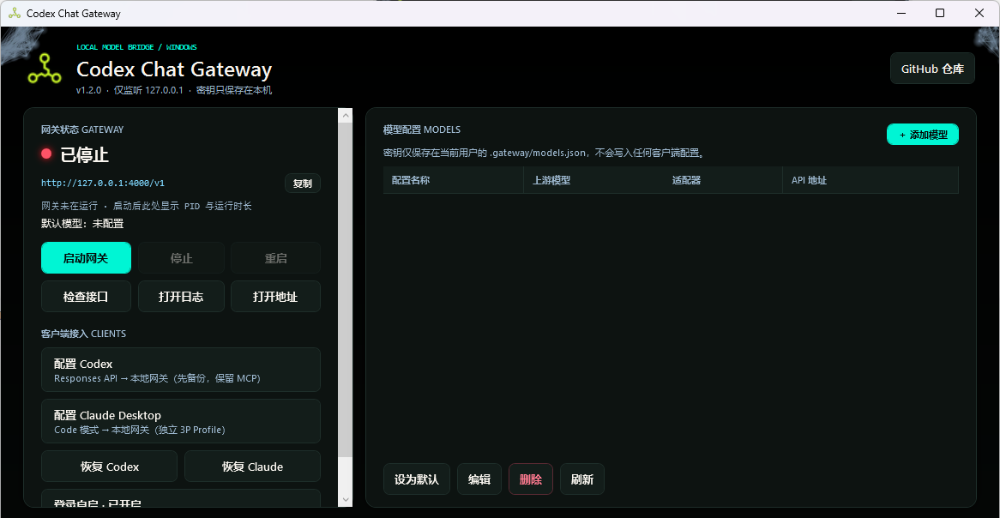
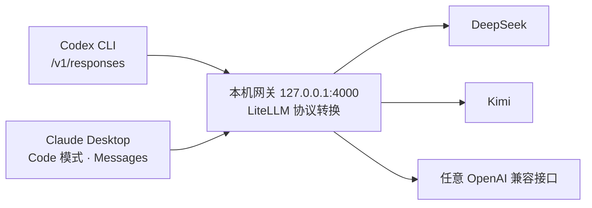

<div align="center">


# Codex Chat Gateway

**把只支持 Chat Completions 的第三方模型，接入 Codex 和 Claude Desktop 的 Code 模式**

[](https://github.com/xuyuanzhang1122/codex-chat-gateway-windows/actions/workflows/release.yml)
[](https://github.com/xuyuanzhang1122/codex-chat-gateway-windows/releases)
[](https://github.com/xuyuanzhang1122/codex-chat-gateway-windows/releases/latest)
[](LICENSE)

[](https://github.com/xuyuanzhang1122/codex-chat-gateway-windows/releases/latest)

[快速开始](#-快速开始) · [功能特性](#-功能特性) · [自动更新](#-自动更新) · [脚本速查](#-脚本速查) · [更新记录](CHANGELOG.md)

</div>

> [!NOTE]
> 本项目是社区兼容工具，不是 OpenAI 官方项目。  
> **推荐入口：Studio 控制台**（Tauri 2 + React + [LobeHub UI](https://ui.lobehub.com/)）。旧版 WPF 控制台仍可并存，但不再作为主推界面。

<div align="center">

</div>

## 🧩 它是做什么的

Codex 请求本机的 `/v1/responses`，Claude Desktop 的 Code 模式请求 Anthropic Messages 接口——而 DeepSeek、Kimi 等第三方模型通常只支持 Chat Completions。本项目在本机 `127.0.0.1:4000` 运行一个 LiteLLM 网关，把两种客户端协议实时转换成上游模型商支持的格式。配置模型、启动网关、接入客户端，全部在桌面控制台里点几下完成。



<details>
<summary><b>为什么不自己实现转换器？</b></summary>

Responses API 不只是字段改名，还涉及 SSE 流式事件、工具调用、错误映射、参数兼容和多轮上下文。本项目直接复用 LiteLLM，只负责 Windows 一键安装、密钥隔离、Codex TOML 安全写入和健康检查。

</details>

## ✨ 功能特性

| 特性 | 说明 |
|---|---|
| 🖥️ **Studio 控制台** | Tauri 2 + LobeHub UI：无边框窗口、侧栏分页、事件驱动网关状态；关窗进托盘，**不停止网关** |
| 📦 **Studio 安装包** | 用户级 Inno 安装、可选卸载旧 C# 版；内嵌 LiteLLM runtime |
| 🔄 **自动更新** | HTTPS GitHub Release + minisign 验签；「客户端 → 检查更新」；**不改** `.gateway` 模型密钥 |
| 🧠 **多模型管理** | 增删改、在线拉取模型列表、设默认；支持 **导入 `api.txt` 风格文本**（`baseurl` / `key` / `model`） |
| 🔀 **双客户端接入** | 同一默认模型同时服务 Codex 与 Claude Desktop 的 Sonnet / Opus / Haiku 路由 |
| ↩️ **安全恢复** | 一键恢复 Codex / Claude Desktop 官方配置，保留 MCP、插件与其他 Profile |
| 🧳 **脚本 / 便携** | 双语 bat + 可选便携 runtime；源码开发可用 `.venv` |

## 🚀 快速开始

### 1️⃣ 下载

前往 [GitHub Releases](https://github.com/xuyuanzhang1122/codex-chat-gateway-windows/releases/latest) 下载：

| 文件 | 说明 |
|---|---|
| **`CodexChatGateway-Studio-Setup-vX.Y.Z.exe`** | **推荐。** Studio 图形安装程序（Tauri 控制台 + runtime） |
| `CodexChatGateway-Studio-Updater-…nsis.zip` + `latest.json` | 应用内自动更新载荷（用户无需手动下载） |
| `codex-chat-gateway-portable-vX.Y.Z-windows-x64.7z` | 遗留便携包 / 旧 WPF 路径，仅作兼容 |
| 同名 `.sha256` | 校验完整性 |

> 如何区分 Studio 与旧 WPF：安装包文件名含 **Studio**，主程序约 **10MB+**，界面为深色 LobeHub 侧栏。详见 [docs/RELEASE_AND_UPDATES.md](docs/RELEASE_AND_UPDATES.md)。

### 2️⃣ 添加模型并启动网关

安装后打开 **Codex Chat Gateway**（或源码目录 `桌面版-Tauri.bat`）：

1. **模型**页：点 **添加模型**，或 **导入 txt**（示例格式见下）；
2. 设好默认模型后，在 **网关**页点 **启动**；
3. 关窗只会隐藏到托盘，网关继续跑；停止请点控制台里的 **停止**。

**`api.txt` 导入示例：**

```text
baseurl：https://api.deepseek.com
key:sk-xxxxxxxx
model:deepseek-v4-flash,deepseek-v4-pro
```

- `model` 可留空：会询问是否在线拉取 `/models`  
- 支持 `：` / `:` / `=`，以及 `base_url` / `api_key` 等别名  

也可以完全用脚本：`模型配置.bat` → `启动网关.bat` → `检查网关.bat`。

### 3️⃣ 接入客户端

| 客户端 | 操作 |
|---|---|
| **Codex** | 控制台「客户端」页配置，或双击 `配置Codex.bat`（写入前自动备份并保留 MCP），然后完全退出并重启 Codex |
| **Claude Desktop** | 「客户端」页或 `配置Claude Desktop Code模式.bat`，完全退出（含托盘）后重新打开并进入 Code 模式 |

> [!TIP]
> 接入后，Codex 中使用的模型名是 **`codex-chat`**，本地地址是 **`http://127.0.0.1:4000/v1`**。

想退出第三方网关？使用控制台恢复按钮，或双击 `恢复Codex官方配置.bat` / `恢复Claude Desktop官方配置.bat`，只撤销网关相关设置。

## 🔄 自动更新

| 项目 | 说明 |
|---|---|
| 用户操作 | **客户端 → 检查更新**（启动时也会静默探测，不自动下载） |
| 通道 | 仅 `https://github.com/…/releases/latest/download/latest.json` |
| 验签 | 安装包内嵌**公钥**；发布者用**私钥**签名更新包（用户无需私钥） |
| 数据 | **不修改** `.gateway/models.json`；不因更新默认停止网关 |

发布者本地签名示例：

```powershell
$env:TAURI_SIGNING_PRIVATE_KEY_PATH = "$env:USERPROFILE\.codex-chat-gateway\tauri-updater.key"
.\scripts\build-updater-artifacts.ps1
```

完整发布说明见 [docs/RELEASE_AND_UPDATES.md](docs/RELEASE_AND_UPDATES.md)。

## 🖥️ Claude Desktop 的 Code 模式

这里配置的是 Claude Desktop **应用内的 Code 模式**，不是普通聊天、MCP 配置，也不是独立的 Claude Code CLI。

- 脚本按 3P Profile 结构写入 `%LOCALAPPDATA%\Claude` 与 `%LOCALAPPDATA%\Claude-3p`，把当前默认模型映射成 Desktop 可识别的 Sonnet、Opus、Haiku 路由；
- 上游 Key **不会**写进 Claude Desktop 配置文件，Profile 中只有无权限的本地占位 Token；
- Claude Desktop 只接受 `claude-sonnet-*`、`claude-opus-*`、`claude-haiku-*` 角色路由，真实的 DeepSeek、Kimi 或其他模型 ID 只保留在本地网关中；
- 切换默认模型后重启网关即可，不需要重新生成 Profile。

## 📜 脚本速查

安装版和便携版目录都提供双语启动器，全部不需要管理员权限：

| 脚本 | 作用 |
|---|---|
| `桌面版-Tauri.bat` / `desktop-tauri.bat` | **Studio 控制台**（推荐） |
| `桌面版.bat` / `desktop.bat` | 旧 WPF 控制台（兼容） |
| `构建Studio安装器.bat` | 本地打 Studio 安装包 |
| `模型配置.bat` / `model-config.bat` | 新增、删除、设置默认模型 |
| `启动网关.bat` / `start-gateway.bat` | 隐藏后台启动网关 |
| `停止网关.bat` / `stop-gateway.bat` | 停止后台服务 |
| `网关状态.bat` / `gateway-status.bat` | 查看运行状态 |
| `检查网关.bat` / `check-gateway.bat` | 接口健康检查 |
| `配置Codex.bat` / `configure-codex.bat` | 写入 Codex 配置（带时间戳备份） |
| `恢复Codex官方配置.bat` / `restore-official-codex.bat` | 恢复 Codex 官方配置 |
| `配置Claude Desktop Code模式.bat` / `configure-claude-desktop.bat` | 写入 Claude Desktop 3P Profile |
| `恢复Claude Desktop官方配置.bat` / `restore-official-claude-desktop.bat` | 恢复官方 1P 模式，保留其他 Profile |
| `enable-autostart.bat` / `disable-autostart.bat` | 登录自启开关 |

> [!NOTE]
> 切换默认模型后需重启网关生效。

## 🔒 安全边界

- 网关固定监听 `127.0.0.1`，不会暴露到局域网；
- 上游密钥只存在于网关进程环境和本机 `.gateway/models.json`，Codex 只访问本地无密钥地址；
- `.env` 和 `.gateway` 已加入 `.gitignore`，分发包不包含任何密钥；**请勿打包或分享 `.gateway` 目录**；
- 配置脚本使用 TOML 解析器修改配置，每次写入前创建带时间戳的备份，恢复脚本只撤销网关自己的字段；
- Claude Desktop 配置采用独立 Profile ID、原子写入和失败回滚，不覆盖 CC Switch 或其他工具的 Profile；
- 自动更新仅 HTTPS Release + 签名校验；**签名私钥不得提交进仓库**；
- 之前已经发到聊天、日志或截图里的 Key 应立即撤销。

## ⚠️ 已知兼容边界

- LiteLLM 会丢弃上游不支持的可选参数，但模型本身仍需支持可靠的工具调用，Codex 才能正常完成代理任务；
- 第三方模型的工具调用格式、上下文长度和指令遵循能力可能弱于 Codex 默认模型；
- `previous_response_id` 等有状态能力由具体 LiteLLM 版本和上游能力决定，本项目主要保障 Codex 的常规流式文本和函数工具调用路径；
- 分发版将 LiteLLM 锁定到 PR [#32995](https://github.com/BerriAI/litellm/pull/32995) 的上游提交，修复 Codex/DeepSeek 多轮工具调用中工具消息不相邻的问题；
- 实际模型调用会消耗上游额度，健康检查不会主动生成内容。

## 📚 进阶主题

<details>
<summary><b>模型配置细节</b></summary>

- 控制台支持手动输入模型 ID，或调用标准 `GET {API URL}/models` 在线列出；也可导入 `baseurl` / `key` / `model` 文本；
- DeepSeek URL 自动使用 `deepseek/模型名` 适配器，其他 OpenAI 兼容 URL 自动使用 `openai/模型名`；
- Key 以明文保存在当前 Windows 用户可访问的本地配置文件中；
- 模型配置保存在本机 `.gateway/models.json`，旧版 `.env` 会在首次运行时自动迁移。

</details>

<details>
<summary><b>源码开发（Studio）</b></summary>

前置：Node 20+、Rust stable、Windows x64。

```powershell
cd desktop-tauri
npm install
npm run tauri dev
```

项目根由 `CODEX_CHAT_GATEWAY_ROOT` 或向上查找 `config.yaml` + `scripts/` 解析。

```powershell
# Studio 完整安装包（含 runtime）
.\scripts\build-tauri-installer.ps1

# 应用内更新包（需签名私钥）
$env:TAURI_SIGNING_PRIVATE_KEY_PATH = "$env:USERPROFILE\.codex-chat-gateway\tauri-updater.key"
.\scripts\build-updater-artifacts.ps1
```

所有 `.ps1` 执行脚本保持纯 ASCII，兼容 Windows PowerShell 5.1。

</details>

<details>
<summary><b>CI/CD 与旧便携包</b></summary>

当前 GitHub Actions 仍构建遗留便携包与旧安装器路径；**Studio** 推荐本机或后续 CI 使用 `build-tauri-installer.ps1` / `build-updater-artifacts.ps1`。

- 推送与 `VERSION` 一致的标签时创建/更新 GitHub Release；
- Studio 发版请同时上传 `latest.json` 与 updater zip，否则应用内检查更新不可用。

本地遗留路径：

```powershell
.\scripts\build-portable.ps1
.\scripts\build-installer.ps1
```

</details>

<details>
<summary><b>依赖与来源</b></summary>

- [LiteLLM](https://github.com/BerriAI/litellm)（协议转换，本机进程）
- [LobeHub UI](https://ui.lobehub.com/)（Studio 界面组件）
- [Tauri](https://tauri.app/)（桌面壳与 Updater）
- [Codex 自定义模型提供商](https://developers.openai.com/codex/config-advanced#custom-model-providers)
- [CC Switch 的 Claude Desktop 实现](https://github.com/farion1231/cc-switch/blob/main/src-tauri/src/claude_desktop_config.rs)（3P Profile 结构参考）

</details>

---

<div align="center">

贡献规范见 [CONTRIBUTING.md](CONTRIBUTING.md) · 版本变化见 [CHANGELOG.md](CHANGELOG.md) · 发布与更新见 [docs/RELEASE_AND_UPDATES.md](docs/RELEASE_AND_UPDATES.md) · 使用许可 [MIT](LICENSE)

**Owner:** [xuyuanzhang1122](https://github.com/xuyuanzhang1122) · 仓库 [codex-chat-gateway-windows](https://github.com/xuyuanzhang1122/codex-chat-gateway-windows)

</div>
