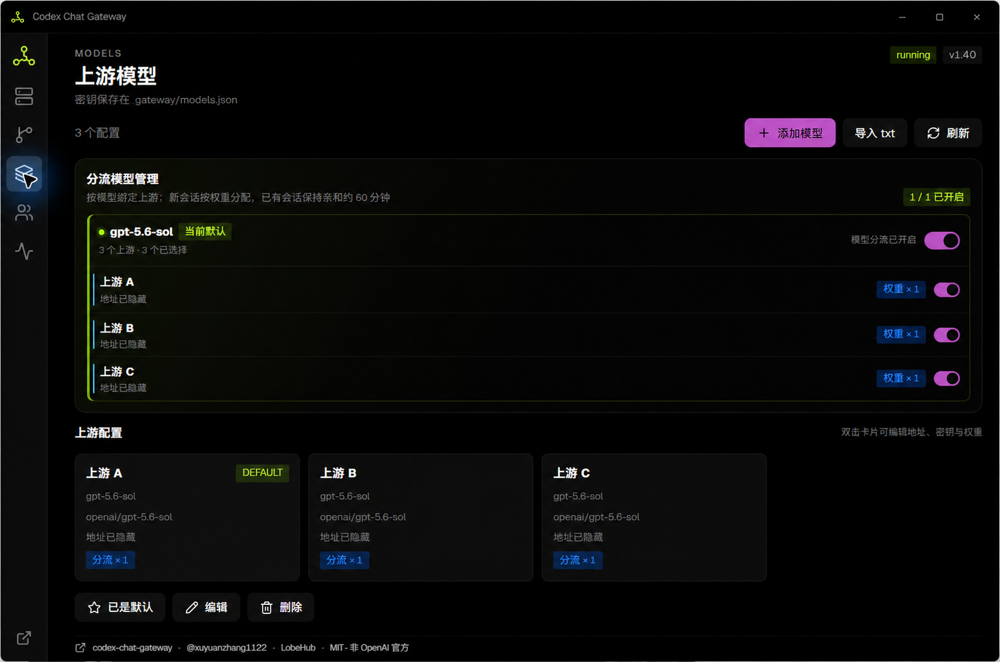
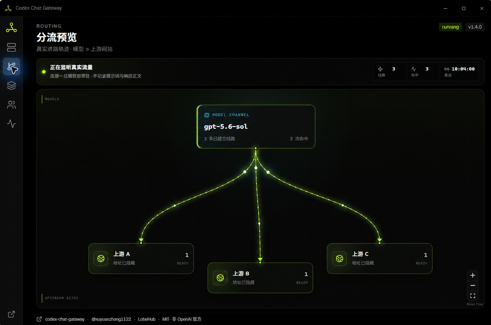

<p align="center">
  
</p>

<h1 align="center">Codex Chat Gateway</h1>

<p align="center">
  Use any model you already pay for with <strong>Codex</strong> and <strong>Claude Desktop</strong>.<br>
  DeepSeek, Kimi, GLM… if it speaks OpenAI-style API, it works — in about three minutes.
</p>

<p align="center">
  <a href="README.md">English</a> ·
  <a href="README.zh-CN.md">简体中文</a>
</p>

<p align="center">
  <a href="https://github.com/xuyuanzhang1122/codex-chat-gateway-windows/actions/workflows/release.yml"></a>
  <a href="https://github.com/xuyuanzhang1122/codex-chat-gateway-windows/releases"></a>
  
  <a href="LICENSE"></a>
</p>

<p align="center">
  <a href="https://github.com/xuyuanzhang1122/codex-chat-gateway-windows/releases/latest"><b>⬇ Download Studio for Windows</b></a>
  ·
  <a href="docs/RELEASE_AND_UPDATES.md">Release & updates</a>
  ·
  <a href="docs/STRUCTURE.md">Repo layout</a>
</p>

---

<p align="center">
  
  <br><sub>Gateway overview — start, stop, restart, health check, endpoint, and recent operations.</sub>
</p>

## New in v1.4.0

- **Route one model across several providers or accounts.** Enable routing per model, switch individual upstreams on or off, and keep a preferred default route.
- **Cache-aware instead of randomly hopping.** Requests from the same session stay with the same upstream whenever possible, preserving that provider's prompt cache; cooldown and failover only move traffic when needed.
- **See where requests actually went.** The Routing Preview page draws persistent animated model → upstream connections and aggregates hit count / last-used time without storing prompts, responses, API keys, or request IDs.

### Model routing controls

The Models page groups configurations by their real model ID. Turn routing on for one model, then independently include or exclude each upstream without deleting its credentials.

<p align="center">
  
</p>

### Live Routing Preview

Once a request uses a route, its animated connection stays on the map. This makes provider selection visible at a glance while only retaining privacy-safe aggregate metadata.

<p align="center">
  
</p>

## What is this

Codex speaks the Responses API. Claude Desktop's Code mode speaks Anthropic Messages. Most third-party models only offer OpenAI-style Chat Completions — so good models sit unused because the protocols don't line up.

This little tool builds a bridge on your own machine at `127.0.0.1:4000`: protocol conversion is delegated to the battle-tested [LiteLLM](https://github.com/BerriAI/litellm), and a ready-to-use Windows console manages models, the gateway process, and client wiring for you.

```text
  Codex ──/v1/responses──┐
                         ├──► 127.0.0.1:4000 (LiteLLM) ──► DeepSeek / Kimi / GLM / any OpenAI-compatible API
  Claude Desktop Code ───┘
```

Two things you can count on: **the gateway only listens on loopback**, so nobody else can reach it; **your API keys never leave your machine** — no logs, no client configs, no uploads.

> Community open-source project — not an official OpenAI product.

## Up and running in 3 minutes

1. **Install**: grab `CodexChatGateway-Studio-Setup-v*.exe` from [Releases](https://github.com/xuyuanzhang1122/codex-chat-gateway-windows/releases/latest) and run it.
2. **Add a model**: open the console → **Models** → fill in `baseurl` / `key` / `model`. Only have a blob of text? **Import txt** parses it for you.
3. **Start**: **Gateway** → hit Start; green means go.
4. **Wire clients**: the **Clients** page writes Codex and Claude Desktop configs in one click — then **fully restart** those apps.

Once connected, Codex only needs two values:

| | |
|---|---|
| Model | `codex-chat` |
| Base URL | `http://127.0.0.1:4000/v1` |

### Import text looks like this

```text
baseurl：https://api.deepseek.com
key:sk-xxxxxxxx
model:deepseek-v4-flash,deepseek-v4-pro
```

`model` may be empty — the console will offer to fetch the list online. `：` / `:` / `=` and common aliases (`base_url`, `api_key`, …) are all accepted.

## Features

| | |
|---|---|
| **Studio console** | Tauri 2 + React + [LobeHub UI](https://ui.lobehub.com/), frameless dark UI; closing the window just sends it to the tray — **the gateway keeps running**. |
| **Models** | CRUD, default-model switching, online `/models` fetch, one-click txt import, and grouped per-model routing controls. |
| **Multi-account routing** | Weighted routing across accounts serving the same model, with session/cache affinity, per-upstream switches, cooldown, failover, and a live model → upstream traffic map. See [routing behavior](docs/MODEL_ROUTING.md). |
| **Client wiring** | One-click Codex provider and Claude Desktop Code mode (3P Profile); one-click restore keeps your MCP servers and other profiles untouched. |
| **Auto-update** | Click "Check for updates" in the console; update packages are minisign-verified and **never touch your `.gateway` config**. |
| **Installer** | Per-user install (no admin needed), English/Chinese UI, optional login autostart; can remove the legacy C# desktop for you. |

## Run from source

```powershell
git clone https://github.com/xuyuanzhang1122/codex-chat-gateway-windows.git
cd codex-chat-gateway-windows\desktop-tauri
npm install
npm run tauri dev
```

| Path | Purpose |
|------|---------|
| `desktop-tauri/` | Studio UI + Rust gateway manager |
| `bin/` | Launchers for a source checkout |
| `scripts/` | Configure / start / build automation (ASCII PowerShell) |
| `desktop/` | Legacy WPF console (kept until Studio fully replaces it) |
| `docs/` | Release, portable, structure notes |
| `examples/` | Sample Codex provider TOML |

## How auto-update works

- **For users**: **Clients → Check for updates** in the console. Startup only probes silently; nothing downloads without your consent.
- **For publishers**: pushing a `v*.*.*` tag makes GitHub Actions build the installer, sign updater artifacts, and upload them with `latest.json` to the Release. Signatures are verified on the client; the private key never enters the repo. Manual builds: [docs/RELEASE_AND_UPDATES.md](docs/RELEASE_AND_UPDATES.md).

## Security boundaries

- The listen address is hard-coded to `127.0.0.1` — there is no switch to expose it.
- Upstream keys live only in process env and `.gateway/models.json`; never in Codex TOML, Claude profiles, logs, or the webview bundle.
- Every "restore official config" script reverses only this project's own fields.
- `.env`, `.gateway/`, and updater signing keys are git-ignored — do not commit them.

## Known limits

- Codex agent work leans heavily on tool calling — your upstream model's tool-calling quality defines the experience.
- Optional params LiteLLM cannot map are dropped.
- LiteLLM is pinned to a commit that includes tool-message adjacency fixes (see `CHANGELOG` / `requirements.txt`).

## Credits

- [LiteLLM](https://github.com/BerriAI/litellm) — protocol bridge
- [LobeHub UI](https://ui.lobehub.com/) — Studio components
- [Tauri](https://tauri.app/) — desktop shell & updater
- Claude Desktop 3P Profile shape cross-checked against [cc-switch](https://github.com/farion1231/cc-switch)

Maintainer: [xuyuanzhang1122](https://github.com/xuyuanzhang1122)

## License

[MIT](LICENSE) · [Changelog](CHANGELOG.md) · [Contributing](CONTRIBUTING.md) · [Third-party notices](THIRD_PARTY_NOTICES.md)
