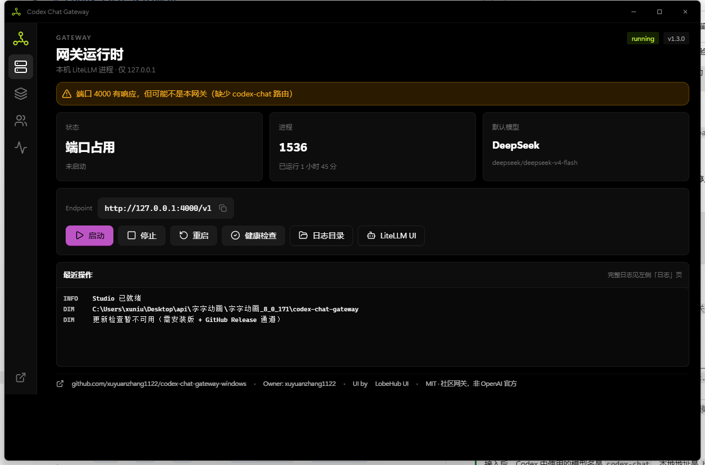

<p align="center">
  
</p>

<h1 align="center">Codex Chat Gateway</h1>

<p align="center">
  让 <strong>Codex</strong> 和 <strong>Claude Desktop</strong> 用上你手里的任何模型。<br>
  DeepSeek、Kimi、GLM……只要接口兼容 OpenAI，三分钟接入。
</p>

<p align="center">
  <a href="README.md">English</a> ·
  <a href="README.zh-CN.md">简体中文</a>
</p>

<p align="center">
  <a href="https://github.com/xuyuanzhang1122/codex-chat-gateway-windows/actions/workflows/release.yml"></a>
  <a href="https://github.com/xuyuanzhang1122/codex-chat-gateway-windows/releases"></a>
  
  <a href="LICENSE"></a>
</p>

<p align="center">
  <a href="https://github.com/xuyuanzhang1122/codex-chat-gateway-windows/releases/latest"><b>⬇ 下载 Windows 安装包</b></a>
  ·
  <a href="docs/RELEASE_AND_UPDATES.md">发布与更新</a>
  ·
  <a href="docs/STRUCTURE.md">仓库结构</a>
</p>

---

<p align="center">
  
</p>

## v1.4.0 新功能

- **同一模型接多家平台或多个账号。** 可以按模型单独开启分流、自由开关每条上游，并保留首选默认线路。
- **缓存友好，不是每次请求硬切。** 同一会话会尽量固定在同一家上游，保住该平台的提示词缓存；只有线路故障或进入冷却时才自动切换。
- **真实流量走向看得见。**「分流预览」会绘制常驻的模型 → 上游动态线路，累计命中次数和最近使用时间；不会保存提示词、响应正文、API Key 或请求 ID。

## 这是什么

Codex 只认 Responses API，Claude Desktop 的 Code 模式只认 Anthropic Messages——而你手里的第三方模型，大多只提供 OpenAI 风格的 Chat Completions。协议对不上，好模型就用不上。

这个小工具在你本机 `127.0.0.1:4000` 架起一座桥：协议转换交给久经考验的 [LiteLLM](https://github.com/BerriAI/litellm)，再配一个开箱即用的 Windows 桌面控制台，管模型、管进程、管客户端接入。

```text
  Codex ──/v1/responses──┐
                         ├──► 127.0.0.1:4000 (LiteLLM) ──► DeepSeek / Kimi / GLM / 任何 OpenAI 兼容接口
  Claude Desktop Code ───┘
```

两件可以放心的事：**网关只听本机回环地址**，别人访问不到；**API Key 只存在你自己电脑上**，不写日志、不进客户端配置、不上传任何地方。

> 社区开源工具，与 OpenAI 官方无关。

## 三分钟跑通

1. **装**：从 [Releases](https://github.com/xuyuanzhang1122/codex-chat-gateway-windows/releases/latest) 下载 `CodexChatGateway-Studio-Setup-v*.exe`，双击安装。
2. **加模型**：打开控制台 →「模型」→ 填上你的 `baseurl` / `key` / `model`。手上只有一段文本？直接「导入 txt」一键解析。
3. **启动**：「网关」→ 点启动，看到绿色状态就通了。
4. **接客户端**：「客户端」页一键写入 Codex 和 Claude Desktop 配置，然后**完全退出并重启**对应客户端。

接好后 Codex 里只需记住两个值：

| | |
|---|---|
| 模型名 | `codex-chat` |
| 地址 | `http://127.0.0.1:4000/v1` |

### 导入文本长这样

```text
baseurl：https://api.deepseek.com
key:sk-xxxxxxxx
model:deepseek-v4-flash,deepseek-v4-pro
```

`model` 留空也行，控制台会问你要不要在线拉取模型列表。`：` / `:` / `=` 都认，`base_url`、`api_key` 等常见别名也认。

## 功能一览

| | |
|---|---|
| **Studio 控制台** | Tauri 2 + React + [LobeHub UI](https://ui.lobehub.com/)，无边框深色界面；关窗自动进托盘，**网关照跑不误**。 |
| **模型管理** | 增删改、默认模型切换、在线拉取 `/models`、txt 文本一键导入，以及按模型分组的分流开关。 |
| **同模型多账号分流** | 按权重分配新会话，同一会话保持平台亲和；可分别开关上游，额度/故障时自动冷却与切换，并提供实时分流预览。详见[分流与缓存说明](docs/MODEL_ROUTING.md)。 |
| **客户端接入** | 一键写 Codex 提供方、一键配置 Claude Desktop Code 模式（3P Profile）；想恢复官方配置也是一键，MCP 和其他 Profile 原样保留。 |
| **自动更新** | 控制台里点「检查更新」即可，更新包经 minisign 验签；**绝不动你的 `.gateway` 配置**。 |
| **安装包** | 用户级安装（不需要管理员）、中英文界面、可选登录自启；能帮你顺手卸掉旧版 C# 桌面程序。 |

## 从源码跑

```powershell
git clone https://github.com/xuyuanzhang1122/codex-chat-gateway-windows.git
cd codex-chat-gateway-windows\desktop-tauri
npm install
npm run tauri dev
```

| 路径 | 作用 |
|------|------|
| `desktop-tauri/` | Studio 界面 + Rust 网关管理 |
| `bin/` | 源码目录下的启动脚本 |
| `scripts/` | 配置 / 启停 / 构建脚本（PowerShell 纯 ASCII） |
| `desktop/` | 旧 WPF 控制台（Studio 稳定前并存） |
| `docs/` | 发布、便携、结构说明 |
| `examples/` | 示例 Codex 提供方 TOML |

## 自动更新是怎么工作的

- **用户侧**：控制台「客户端 → 检查更新」。启动时只做静默探测，不经你同意不会下载任何东西。
- **发布侧**：GitHub Actions 打 tag 自动构建安装包、签名更新包和 `latest.json` 并上传到 Release；签名校验在客户端本地完成，私钥永远不进仓库。手动构建见 [docs/RELEASE_AND_UPDATES.md](docs/RELEASE_AND_UPDATES.md)。

## 安全边界

- 监听地址写死 `127.0.0.1`，没有开关可以改成对外暴露。
- 上游 Key 只存在于进程环境和 `.gateway/models.json`，不会出现在 Codex TOML、Claude Profile、日志或前端资源里。
- 所有「恢复官方配置」脚本只撤销本项目写入的字段，其余一律不碰。
- `.env`、`.gateway/`、更新签名私钥都在 `.gitignore` 里，请勿提交。

## 已知限制

- Codex 的代理任务重度依赖工具调用，上游模型的 tool-calling 质量直接决定体验。
- LiteLLM 无法映射的可选参数会被丢弃。
- LiteLLM 锁定在含工具消息相邻性修复的提交（见 `CHANGELOG` / `requirements.txt`）。

## 致谢

- [LiteLLM](https://github.com/BerriAI/litellm) — 协议转换
- [LobeHub UI](https://ui.lobehub.com/) — Studio 组件
- [Tauri](https://tauri.app/) — 桌面壳与更新器
- Claude Desktop 3P Profile 结构参考 [cc-switch](https://github.com/farion1231/cc-switch)

维护者：[xuyuanzhang1122](https://github.com/xuyuanzhang1122)

## 许可

[MIT](LICENSE) · [更新记录](CHANGELOG.md) · [贡献指南](CONTRIBUTING.md) · [第三方声明](THIRD_PARTY_NOTICES.md)
